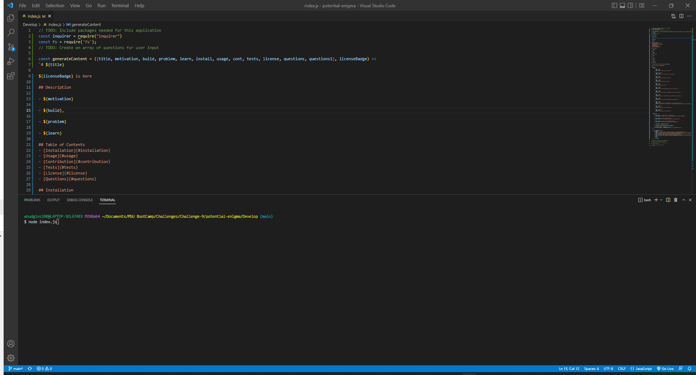
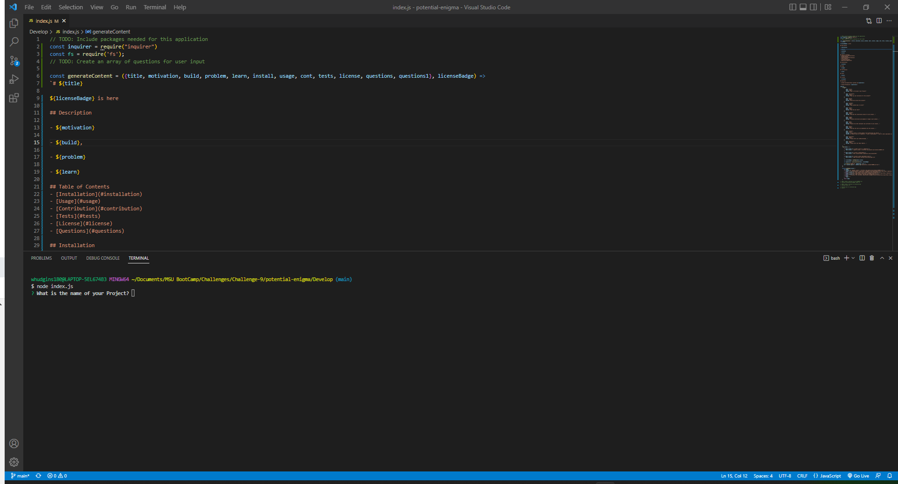

# Genereate a Professional README

## Description

- I was getting tired of hard coding all my seperate README's

- I decided an easier way to solve this problem would be to make a project for this!,

- It saves you time from hard coding all your README's by taking in your information off a series of prompts and inserting it all into a Professional README instantly!

- I learned that using npm inquirer will come in handy for many years to come!

## Table of Contents
- [Installation](#installation)
- [Usage](#usage)
- [Contribution](#contribution)
- [Tests](#tests)
- [License](#license)
- [Questions](#questions)

## Installation

- First you need to have node js downloaded. Second you need to install npm Inquirer. After that just follow the prompts in the CLI!

## Usage

- Upon loading the prject, enter in the CLI "npm i inquirer@5.6.0". 

- Secondly, enter "node [filename]" into the CLI to execute the file. 

 

- And lastly, follow all the prompts as indicated.

 

## Contribution

- Email me if you would like to contribute in any way!

## Tests

- No tests were required for this project.

## License

- [Apache License v 2.0](http://www.apache.org/licenses/LICENSE-2.0)

## Questions

- [My GitHub Profile](https://github.com/wbhudgins)

- [Contact Me](mailto: wbhudgins@mail.mccneb.edu)

- [Link to Demo Video](https://app.castify.com/view/e85a8796-e564-42d1-91f4-91961ec59eda)